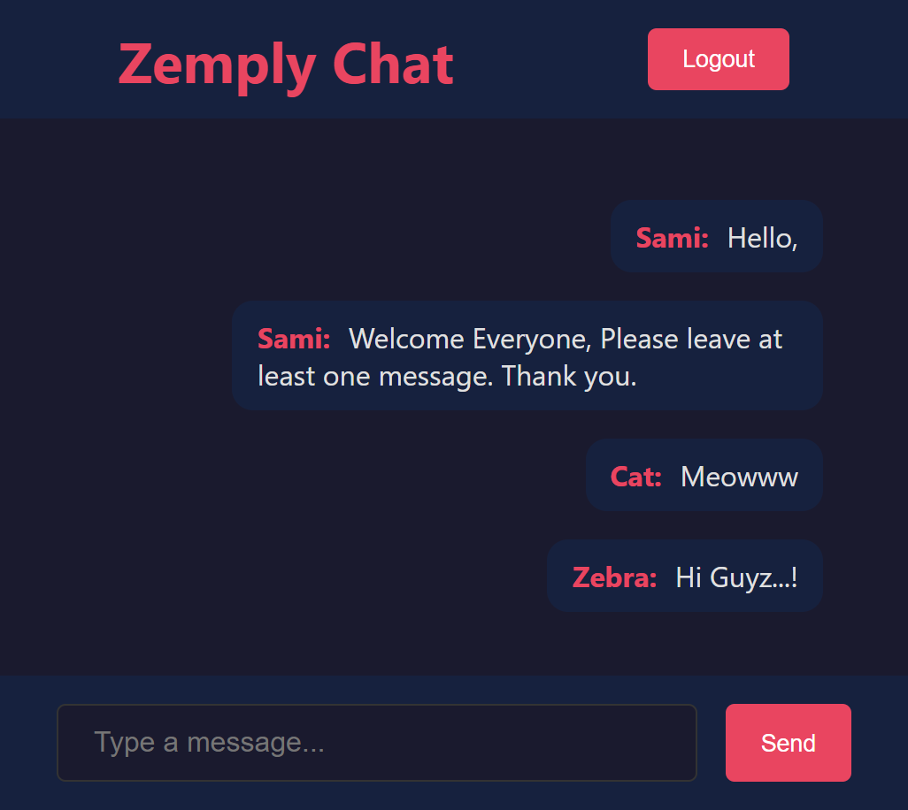

# Zemply Chat

A real-time chat application built from scratch as a full-stack learning project.

🔗 **Live Demo**: [zemply-chat-app.vercel.app](https://zemply-chat-app.vercel.app/)



## What It Does

- Real-time messaging between multiple users using WebSockets
- User signup and login with hashed passwords
- Messages persist in the database — they don't disappear on refresh
- Last 50 messages load automatically when you connect
- Protected routes — no access to chat without logging in

## Tech Stack

| Layer | Technology |
|-------|-----------|
| Frontend | React (Vite) |
| Backend | Node.js + Express |
| Real-time | Socket.io |
| Database | MongoDB Atlas + Mongoose |
| Auth | JWT + bcrypt |
| Routing | React Router |

## Project Structure

```
├── server.js              # Express server + Socket.io setup
├── Models/
│   ├── message.js         # Message schema (text, username, timestamp)
│   └── user.js            # User schema (username, hashed password)
├── Controllers/
│   ├── signup.js           # Signup logic + password hashing
│   └── login.js            # Login logic + JWT token generation
├── Routes/
│   └── route.js            # Auth routes (/signup, /login)
├── Frontend/
│   └── src/
│       ├── App.jsx         # React Router setup
│       ├── pages/
│       │   ├── Chat.jsx    # Chat UI + Socket.io client
│       │   ├── Login.jsx   # Login form
│       │   └── Signup.jsx  # Signup form
│       └── index.css       # Global styles
```

## How It Works

1. User signs up → password gets hashed with bcrypt → stored in MongoDB
2. User logs in → server verifies password → returns a JWT token
3. Token is stored in localStorage → used to protect the chat route
4. On entering chat → Socket.io connects to the server → loads last 50 messages
5. User sends a message → server saves it to MongoDB → broadcasts to all connected users

## Problems Solved During Development

- **CORS errors** — Frontend (port 5173) and backend (port 4000) run on different ports. Had to configure CORS for both Express and Socket.io separately.
- **Database timing crash** — Server was accepting socket connections before MongoDB was ready. Fixed by connecting to MongoDB first, then starting the server.
- **Message duplication** — Socket connections weren't being cleaned up on page navigation. Fixed with useEffect cleanup function (`socket.disconnect()`).
- **CSS flexbox + overflow conflict** — `justify-content: flex-end` breaks `overflow-y: auto`. Fixed with `::before` pseudo-element trick.
- **Auth state leaking between accounts** — Signup wasn't saving the new user's token to localStorage. Fixed by returning token on signup, not just on login.

## Setup

### Prerequisites
- Node.js
- MongoDB Atlas account (free)

### Run Locally

1. Clone the repo
```bash
git clone https://github.com/sudoSami/Zemply-Chat-App.git
cd Zemply-Chat-App
```

2. Install backend dependencies
```bash
npm install
```

3. Install frontend dependencies
```bash
cd Frontend
npm install
```

4. Create a `.env` file in the root
```
MONGO_URI=your_mongodb_connection_string
JWT_SECRET=your_secret_key
```

5. Start the backend
```bash
npm start
```

6. Start the frontend (in a separate terminal)
```bash
cd Frontend
npm run dev
```

7. Open `http://localhost:5173`

## Author

**Sami** — [GitHub](https://github.com/sudoSami)
